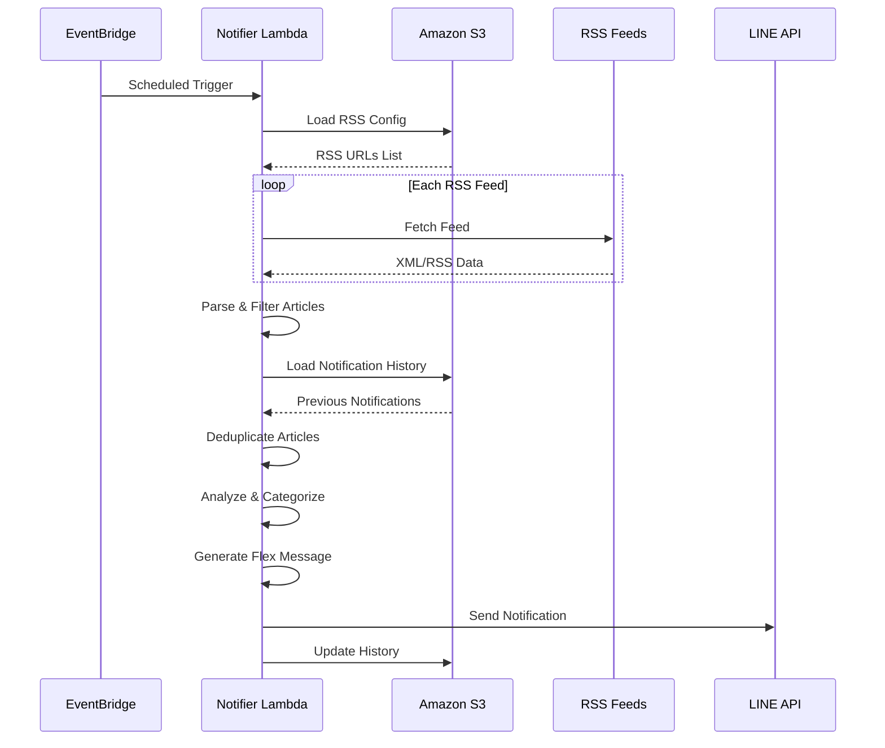
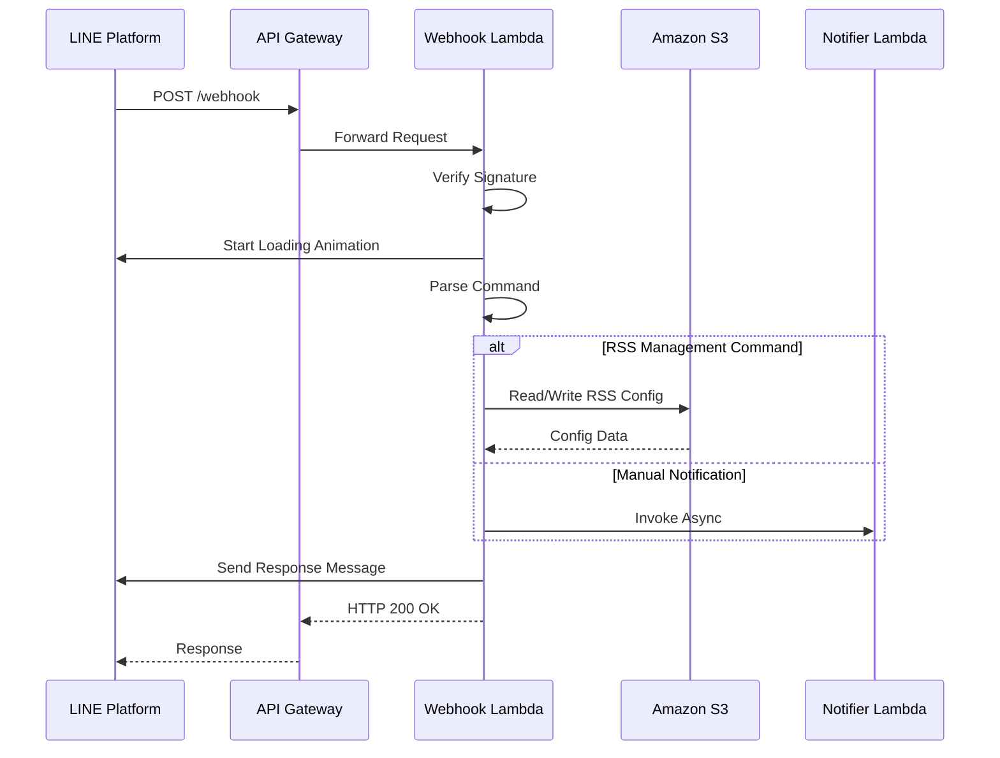

# RSS LINE Notifier - アーキテクチャ設計書

## 🏗️ システムアーキテクチャ概要

### アーキテクチャパターン
- **サーバーレスアーキテクチャ**: AWS Lambda中心の構成
- **イベント駆動型**: EventBridge + Lambda の非同期処理
- **マイクロサービス**: 機能別Lambda関数の分離設計
- **ステートレス**: S3による状態管理、Lambda関数は完全ステートレス

### システム全体図
```
┌─────────────────┐    ┌──────────────┐    ┌─────────────┐
│   LINE Platform │────│ API Gateway  │────│   Webhook   │
│                 │    │              │    │   Lambda    │
└─────────────────┘    └──────────────┘    └─────────────┘
                                                    │
                                                    ▼
┌─────────────────┐    ┌──────────────┐    ┌─────────────┐
│   EventBridge   │────│   Schedule   │────│  Notifier   │
│  (Cron Trigger) │    │  (JST 12:30  │    │   Lambda    │
│                 │    │       21:00) │    │             │
└─────────────────┘    └──────────────┘    └─────────────┘
                                                    │
                                                    ▼
                       ┌──────────────┐    ┌─────────────┐
                       │   Amazon S3  │────│  RSS Feeds  │
                       │              │    │  External   │
                       └──────────────┘    └─────────────┘
                               │
                               ▼
                       ┌──────────────┐
                       │ CloudWatch   │
                       │    Logs      │
                       └──────────────┘
```

## 🔧 コンポーネント設計

### 1. Lambda Functions

#### 1.1 Notifier Lambda (rss-notifier-v1)
**責務**: RSS監視・記事収集・LINE通知

**処理フロー**:
```python
def lambda_handler(event, context):
    # 1. S3からRSS設定読み込み
    rss_feeds = load_rss_config_from_s3()

    # 2. 各RSSフィードを並列処理
    articles = process_rss_feeds_parallel(rss_feeds)

    # 3. 新着記事フィルタリング（24時間以内）
    new_articles = filter_recent_articles(articles)

    # 4. 通知履歴と照合して重複除去
    unique_articles = deduplicate_with_history(new_articles)

    # 5. 記事分析・分類（v2.1機能）
    analyzed_articles = analyze_articles(unique_articles)

    # 6. カテゴリ別グループ化
    categorized = group_by_category(analyzed_articles)

    # 7. Flexメッセージ生成
    flex_message = create_carousel_message(categorized)

    # 8. LINE API送信
    send_line_message(flex_message)

    # 9. 通知履歴更新
    update_notification_history(unique_articles)
```

**技術仕様**:
- **Runtime**: Python 3.9
- **Memory**: 512MB
- **Timeout**: 15分
- **Environment Variables**:
  - `LINE_TOKEN`, `LINE_USER_ID`, `BUCKET_NAME`

#### 1.2 Webhook Lambda (rss-webhook-v1)
**責務**: LINE Webhookハンドリング・ユーザーコマンド処理

**処理フロー**:
```python
def lambda_handler(event, context):
    # 1. LINE署名検証
    if not verify_line_signature(event):
        return unauthorized_response()

    # 2. Webhook イベント解析
    line_events = parse_line_webhook(event)

    # 3. 各イベントを処理
    for line_event in line_events:
        # 4. Loading Animation開始
        start_loading_animation(line_event.source.user_id)

        # 5. コマンド解析・実行
        response = process_user_command(line_event.message.text)

        # 6. レスポンス送信
        send_push_message(line_event.source.user_id, response)

    return success_response()
```

**技術仕様**:
- **Runtime**: Python 3.9
- **Memory**: 256MB
- **Timeout**: 30秒
- **Environment Variables**:
  - `LINE_TOKEN`, `LINE_CHANNEL_SECRET`, `BUCKET_NAME`, `NOTIFIER_FUNCTION_NAME`

### 2. Storage Layer (Amazon S3)

#### 2.1 S3 Bucket 構成
```
rss-line-notifier-v1-{AccountId}/
├── rss-list.json           # RSS設定ファイル
├── notified-history.json   # 通知履歴ファイル
└── temp/                   # 一時ファイル（必要に応じて）
```

#### 2.2 データ構造設計

**RSS設定 (rss-list.json)**:
```json
{
  "feeds": [
    {
      "url": "https://qiita.com/popular/items/feed",
      "title": "Qiita - 人気の記事",
      "category": "プログラミング",
      "enabled": true,
      "added_at": "2024-01-01T00:00:00Z"
    }
  ],
  "updated_at": "2024-01-01T12:00:00Z",
  "version": "2.1"
}
```

**通知履歴 (notified-history.json)**:
```json
{
  "history": [
    {
      "title": "記事タイトル",
      "link": "https://example.com/article",
      "feed_title": "Example Feed",
      "notified_at": "2024-01-01T12:00:00Z",
      "article_hash": "sha256hash"
    }
  ],
  "last_cleanup": "2024-01-01T00:00:00Z",
  "total_notifications": 1250
}
```

### 3. API Gateway 設計

#### 3.1 エンドポイント構成
```
POST /webhook
├── Integration: Webhook Lambda
├── CORS: Disabled (LINE専用)
├── Rate Limiting: 100 req/sec
└── Request Size: 1MB Max
```

#### 3.2 セキュリティ設定
- **HTTPS Only**: TLS 1.2以上
- **IP制限**: LINE Platform IPアドレス範囲
- **署名検証**: Lambda内でX-Line-Signatureヘッダー検証

### 4. EventBridge 設計

#### 4.1 スケジュール設定
```yaml
NotificationSchedule:
  ScheduleExpression: "cron(30 03 * * ? *)"  # JST 12:30 (UTC 03:30)
  State: ENABLED
  Target: Notifier Lambda

EveningNotificationSchedule:
  ScheduleExpression: "cron(00 12 * * ? *)"  # JST 21:00 (UTC 12:00)
  State: ENABLED
  Target: Notifier Lambda
```

## 📊 データフロー設計

### 1. RSS監視フロー


### 2. Webhook処理フロー


## 🔐 セキュリティアーキテクチャ

### 1. 認証・認可設計
```yaml
IAM Roles:
  NotifierLambdaRole:
    Policies:
      - S3: GetObject, PutObject (specific bucket)
      - Logs: CreateLogGroup, CreateLogStream, PutLogEvents
      - Lambda: InvokeFunction (self only)

  WebhookLambdaRole:
    Policies:
      - S3: GetObject, PutObject (specific bucket)
      - Logs: CreateLogGroup, CreateLogStream, PutLogEvents
      - Lambda: InvokeFunction (notifier only)
```

### 2. データ暗号化
- **S3**: Server-Side Encryption (AES256)
- **Lambda**: Environment Variables Encryption (KMS)
- **API Gateway**: TLS 1.2 in transit

### 3. アクセス制御
```yaml
S3 Bucket Policy:
  - Block Public Access: All
  - VPC Endpoint: Optional
  - Cross-Account Access: Denied
  - Versioning: Enabled
```

## ⚡ パフォーマンス設計

### 1. Lambda最適化
```python
# 接続プールの再利用
import requests
session = requests.Session()

# グローバル変数でのクライアント初期化
s3_client = boto3.client("s3")

# 並列処理でのRSS取得
import concurrent.futures
with concurrent.futures.ThreadPoolExecutor(max_workers=10) as executor:
    futures = [executor.submit(fetch_rss, url) for url in rss_urls]
```

### 2. メモリ・実行時間最適化
- **Notifier Lambda**: 512MB、15分タイムアウト
- **Webhook Lambda**: 256MB、30秒タイムアウト
- **同時実行数**: 1000（デフォルト制限）

### 3. APIレスポンス最適化
```python
# 非同期レスポンスパターン
def lambda_handler(event, context):
    # 1. 即座にLINEに200レスポンス
    start_loading_animation()

    # 2. バックグラウンドで処理実行
    process_command_async()

    # 3. 完了後にPush Message送信
    send_result_message()

    return {"statusCode": 200}
```

## 🚀 スケーラビリティ設計

### 1. 水平スケーリング対応
- **Lambda**: 自動スケーリング（同時実行数制限内）
- **S3**: 無制限スケーリング
- **API Gateway**: 自動スケーリング

### 2. マルチユーザー拡張設計
```python
# ユーザー別データ分離
def get_user_config_key(user_id: str) -> str:
    return f"users/{user_id}/rss-list.json"

def get_user_history_key(user_id: str) -> str:
    return f"users/{user_id}/notified-history.json"
```

### 3. リージョン展開
- **プライマリ**: ap-northeast-1 (Tokyo)
- **セカンダリ**: us-east-1 (N. Virginia) ※グローバル展開時

## 📈 監視・ログ設計

### 1. CloudWatch メトリクス
```yaml
Custom Metrics:
  - RSS_FETCH_SUCCESS_COUNT
  - RSS_FETCH_ERROR_COUNT
  - ARTICLES_PROCESSED_COUNT
  - LINE_MESSAGE_SENT_COUNT
  - WEBHOOK_COMMAND_COUNT
```

### 2. ログ設計
```python
# 構造化ログ
import json
logger.info(json.dumps({
    "event": "rss_fetch_completed",
    "feed_url": feed_url,
    "articles_count": len(articles),
    "processing_time_ms": processing_time,
    "timestamp": datetime.utcnow().isoformat()
}))
```

### 3. アラート設定
- **Error Rate > 5%**: 即座通知
- **Function Duration > 14分**: 警告通知
- **Memory Usage > 90%**: 警告通知

## 🔄 災害復旧設計

### 1. バックアップ戦略
- **S3 Versioning**: 有効化
- **Cross-Region Replication**: 必要に応じて設定
- **Lambda Code**: S3バックアップ

### 2. フェイルオーバー
```yaml
Primary Region Failure:
  1. DNS Failover (Route53)
  2. Secondary Region Activation
  3. S3 Cross-Region Restore
  4. Lambda Function Deployment
```

### 3. 復旧手順
1. **部分障害**: 自動リトライ機能
2. **完全障害**: 手動フェイルオーバー
3. **データ復旧**: S3バージョニングからの復元

このアーキテクチャ設計は、高可用性、セキュリティ、パフォーマンスを考慮したサーバーレス設計となっています。